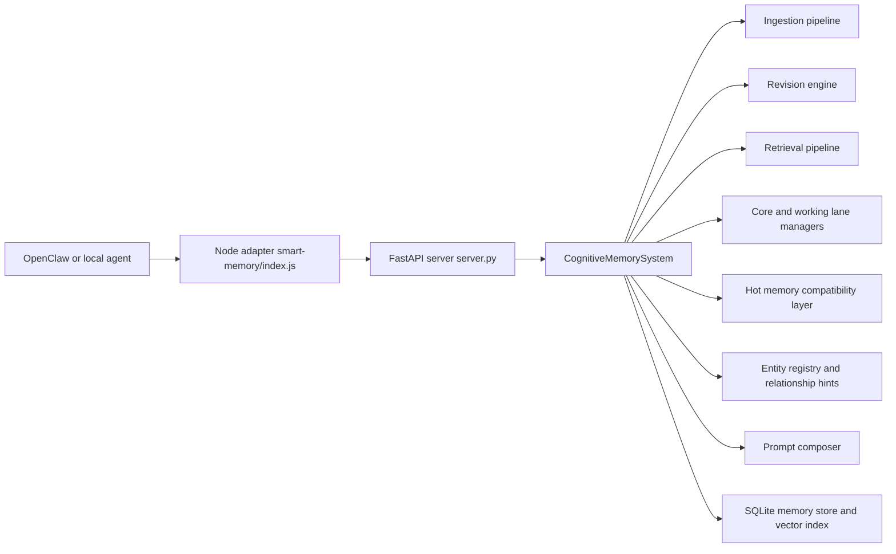

# Smart Memory v3 Experimental

Smart Memory is a local-first agent memory backend for OpenClaw and adjacent runtimes. The `experimental` branch upgrades the project from retrieval-heavy v2 behavior to a revision-aware v3 architecture with canonical SQLite storage, deterministic memory lifecycle handling, and first-class core and working memory lanes.

## What v3 changes

- SQLite is now the canonical long-term memory backend.
- Memory records carry status, validity windows, revision links, lane eligibility, retrieval tags, and optional structured facets.
- Ingestion is revision-aware: semantic change becomes `SUPERSEDE`, metadata-only change can `UPDATE`, and stale time-bound memories can `EXPIRE`.
- Core and working memory lanes are first-class concepts instead of being implied purely by retrieval.
- Retrieval excludes superseded and expired memories by default and uses configurable scoring weights.
- Entity normalization and lightweight relationship hints improve recall without requiring a graph database.
- Migration and evaluation scaffolding are included so legacy stores can be upgraded and v3 behavior can be compared against a v2-style baseline.

## Design constraints

- Local-first and inspectable
- Deterministic before optional LLM assistance
- Bounded prompt assembly with deterministic eviction
- Minimal infrastructure and no hosted-service requirement
- Additive compatibility for existing OpenClaw and Node adapter paths

## Architecture



## Memory model highlights

Each v3 memory record includes:

- identity and content: `id`, `content`, `memory_type`
- lifecycle: `status`, `revision_of`, `supersedes`, `valid_from`, `valid_to`, `decay_policy`
- scoring and trust: `importance_score`, `confidence`, `explanation`
- traceability: `created_at`, `updated_at`, `last_accessed_at`, `access_count`, `source_session_id`, `source_message_ids`
- retrieval hints: `entities`, `keywords`, `retrieval_tags`, `lane_eligibility`, `pinned_priority`
- optional structured facets used by deterministic revision rules when derivable: `subject_entity_id`, `attribute_family`, `normalized_value`, `state_label`

### Supported types

- `episodic`
- `semantic`
- `belief`
- `goal`
- `preference`
- `identity`
- `task_state`

### Supported statuses

- `active`
- `superseded`
- `expired`
- `uncertain`
- `archived`
- `rejected`

### Revision actions

- `ADD`
- `UPDATE` for metadata-only changes
- `SUPERSEDE` for semantic changes
- `EXPIRE`
- `MERGE` when duplication is extremely clear
- `NOOP`
- `REJECT`

## Request flow

1. `/ingest` accepts an interaction or candidate memory.
2. The ingestion pipeline classifies memory type, extracts entities, derives optional facets, scores importance, and finds related prior memories.
3. The revision engine decides `ADD`, `UPDATE`, `SUPERSEDE`, `EXPIRE`, `NOOP`, `MERGE`, or `REJECT`.
4. The SQLite store updates memory rows, lane membership, entity links, and audit events.
5. `/retrieve` returns ranked active memories, excluding stale statuses by default.
6. `/compose` builds prompt context in deterministic order: system prompt, core memory, working context, retrieved memory, recent conversation.

## Storage layout

Canonical runtime storage now looks like this:

```text
workspace/
+- data/
   +- memory_store/
   |  +- v3_memory.sqlite
   |  +- memories/                  # legacy JSON import/export compatibility
   |  +- archive/                   # legacy JSON archive compatibility
   +- hot_memory/
      +- hot_memory.json            # compatibility projection for working context and insights
```

The SQLite database contains explicit tables for memories, lane memberships, entity links, relationship hints, audit events, and schema migrations. JSON storage is kept for migration, fixtures, and export.

See [MEMORY_STRUCTURE.md](/D:/Users/JamesMSI/Desktop/LLM%20Projects/Smart%20Memory/smart-memory/.release-repo/MEMORY_STRUCTURE.md) for the detailed layout.

## Quick start

### Install

```bash
git clone https://github.com/BluePointDigital/smart-memory.git
cd smart-memory/smart-memory
npm install
```

`npm install` creates `.venv`, installs CPU-only PyTorch, and installs the Python runtime requirements used by the FastAPI service.

### Start the API directly

```bash
.\.venv\Scripts\python -m uvicorn server:app --host 127.0.0.1 --port 8000
```

### Or use the Node adapter

```js
import memory from "smart-memory";

await memory.start();

await memory.ingestMessage({
  user_message: "I prefer coffee now instead of tea.",
  assistant_message: "Preference updated.",
  source_session_id: "session-42",
  source_message_ids: ["msg-1"],
});

const retrieval = await memory.retrieveContext({
  user_message: "What do I prefer now?",
  conversation_history: "",
});

const prompt = await memory.getPromptContext({
  agent_identity: "You are a persistent cognitive assistant.",
  current_user_message: "Continue the project update.",
  conversation_history: "",
  max_prompt_tokens: 512,
});
```

## HTTP API surface

Existing endpoints remain available:

- `GET /health`
- `POST /ingest`
- `POST /retrieve`
- `POST /compose`
- `POST /run_background`
- `GET /memories`
- `GET /memory/{memory_id}`
- `GET /insights/pending`

New v3 inspection and lane endpoints:

- `POST /revise`
- `GET /memory/{memory_id}/history`
- `GET /memory/{memory_id}/active`
- `GET /memory/{memory_id}/chain`
- `GET /lanes/{lane_name}`
- `POST /lanes/{lane_name}/{memory_id}`
- `DELETE /lanes/{lane_name}/{memory_id}`
- `GET /eval/suite/{suite_name}`
- `GET /eval/case/{case_id}`

See [INTEGRATION.md](/D:/Users/JamesMSI/Desktop/LLM%20Projects/Smart%20Memory/smart-memory/.release-repo/INTEGRATION.md) for agent wiring guidance.

## Core and working memory lanes

- Core lane stores pinned, high-confidence, durable context such as identity and stable preferences.
- Working lane stores active task and goal context with aggressive configurable decay.
- Retrieved lane is selected at runtime and excludes superseded or expired memory by default.
- The current prompt renderer projects working-lane state into the `[WORKING CONTEXT]` section through the hot-memory compatibility layer, while core memories render as dedicated `[CORE MEMORY]` blocks.

## Migration and evaluation

### Migration

`migration/v3_migration.py` upgrades legacy JSON memories into SQLite, backfilling v3 defaults such as status, lane eligibility, source session placeholders, and normalized entities where possible.

### Evaluation

`evaluation/eval_runner.py` compares:

- `baseline_v2`
- `v3_revision_only`
- `v3_full`

The harness reports pass/fail, precision, recall, stale-memory leakage, incorrect active memory count, hit ranking, and token-budget compliance. The repo currently ships a seeded `preference_change` scenario and the scaffolding for broader suites.

## Repository map

```text
.release-repo/
+- cognitive_memory_system.py
+- server.py
+- smart_memory_config.py
+- ingestion/
+- revision/
+- retrieval/
+- memory_lanes/
+- entities/
+- prompt_engine/
+- storage/
+- migration/
+- evaluation/
+- hot_memory/
+- skills/smart-memory-openclaw/
+- smart-memory/
+- tests/
```

## Testing

Run the Python test suite from the repo root:

```bash
.\.venv\Scripts\python -m pytest -q
```

The current branch includes v3 coverage for revision behavior, lane promotion, migration, evaluation mode output, and backward-compatible API paths.

## Status

This branch is the active v3 development line. The implementation is additive, local-first, and intentionally conservative about automatic memory mutation. SQLite, revision-aware ingestion, lane management, migration, and evaluation scaffolding are in place; use the branch to continue iterating on scenario coverage, docs, and integration polish.

