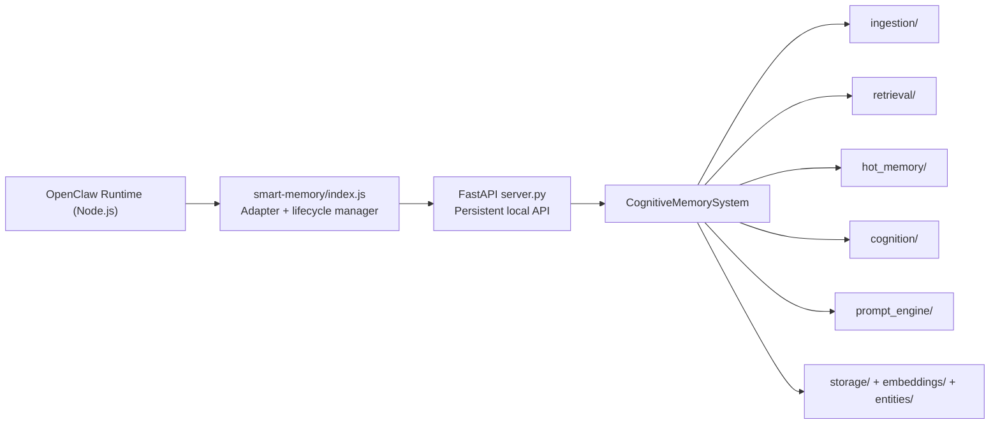
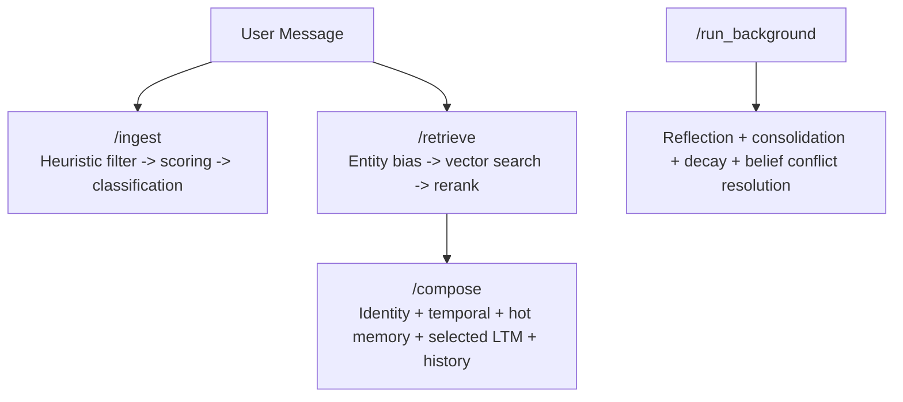

# Smart Memory v2 - Cognitive Architecture for OpenClaw

<p>
  
  
  
  
  
</p>

> **Not a basic RAG cache.**  
> Smart Memory v2 is a persistent, local cognitive engine for OpenClaw: schema-versioned memory objects, hot working memory, background cognition, and a continuously running FastAPI process that keeps retrieval fast.

---

## Quick Value (60 seconds)

| You Need | Smart Memory v2 Gives You |
|---|---|
| Agent continuity across sessions | Structured long-term memory (`episodic`, `semantic`, `belief`, `goal`) |
| Fast semantic recall | Local Nomic embeddings + vector search + reranking |
| Reduced hallucinated "state drift" | Prompt composer with temporal state + hot memory + strict context budgeting |
| Better long-run memory quality | Background reflection, consolidation, decay, belief conflict resolution |
| Low latency after startup | Persistent FastAPI process keeps embedder/DB connections hot |

---

## Why This Exists

Most memory plugins are retrieval wrappers. They do not behave like cognition.  
Smart Memory v2 is designed as a **cognitive pipeline**:

- `Ingestion`: Decide what is memory-worthy.
- `Retrieval`: Find relevant memories with entity and time bias.
- `Working Memory`: Keep a small, high-signal "mind state."
- `Background Cognition`: Reflect, consolidate, decay, and resolve conflicts.
- `Prompt Composition`: Assemble bounded, coherent context for the model.

---

## Architecture At A Glance



### Request Flow



---

## Feature Highlights

### ?? Hybrid Node + Python Design
- OpenClaw stays in Node.
- Heavy cognitive operations run in Python.
- `index.js` is a thin adapter that talks HTTP to `localhost:8000`.

### ? Cold-Start Prevention
- The adapter launches `uvicorn` once and keeps it alive.
- Nomic embeddings and storage connections remain warm between calls.

### ?? REM-Style Background Cognition
- Periodic background cycle handles:
- reflection + associative insights
- memory consolidation
- decay + vector pruning
- belief conflict resolution

### ?? Entity-Aware Retrieval
- Retrieval pipeline supports:
- vector similarity candidate pool
- entity-biased ranking
- time-aware filtering
- final reranked selection

### ? Curiosity Triggers
- Associative insight generation computes a curiosity score from emotional intensity and familiarity.
- High-curiosity memories can become proactive working questions:
- `"User was very frustrated by X, did they resolve it?"`

### ?? Schema-First Memory Objects
- JSON documents validated with Pydantic.
- Schema versioning + entity IDs + relations + emotional metadata.

---

## Memory Layers

| Layer | Purpose | Example Content |
|---|---|---|
| Agent Identity | Stable behavior anchor | role, mission, style |
| Temporal State | Time continuity | current time, last interaction delta, state |
| Hot Memory | Current cognitive focus | active projects, top-of-mind, working questions |
| Long-Term Memory | Durable history | episodic/semantic/belief/goal objects |
| Insight Queue | Background reflections | confidence-scored insight objects |
| Conversation Context | Immediate grounding | recent turns + current user input |

---

## Repository Layout

```text
.
+- server.py
+- cognitive_memory_system.py
+- prompt_engine/
+- ingestion/
+- retrieval/
+- hot_memory/
+- cognition/
+- storage/
+- embeddings/
+- entities/
+- smart-memory/
   +- index.js         # OpenClaw adapter
   +- postinstall.js   # Python venv/bootstrap
```

---

## Installation

### Option A: ClawHub

```bash
npx clawhub install smart-memory
```

### Option B: From GitHub

```bash
git clone https://github.com/BluePointDigital/smart-memory.git
cd smart-memory/smart-memory
npm install
```

### What `npm install` Does

`postinstall.js` automatically:

1. Creates `.venv` at repository root.
2. Upgrades `pip`.
3. Installs `requirements-cognitive.txt`.
4. Prepares FastAPI + cognitive dependencies (`sentence-transformers`, `qdrant-client`, etc.).

Works on both Windows and Unix path conventions.

---

## How To Use

### 1. Import the adapter

```js
import memory from "smart-memory";
```

### 2. Start (or let wrappers auto-start)

```js
await memory.start();
```

### 3. Ingest a new interaction

```js
await memory.ingestMessage({
  user_message: "I started migrating our database today.",
  assistant_message: "Great, we should track risks and rollback strategy.",
  timestamp: new Date().toISOString()
});
```

### 4. Retrieve context

```js
const retrieval = await memory.retrieveContext({
  user_message: "How is the migration going?",
  conversation_history: "..."
});
```

### 5. Compose prompt context

```js
const composed = await memory.getPromptContext({
  agent_identity: "You are a persistent cognitive assistant.",
  conversation_history: "...",
  current_user_message: "Continue from where we left off."
});
```

### 6. Optional manual background run

```js
await memory.runBackground(true);
```

### 7. Shutdown cleanly

```js
await memory.stop();
```

---

## Adapter Lifecycle (Automatic)

`smart-memory/index.js` handles process orchestration:

- starts Python FastAPI server if `/health` is not ready
- waits until healthy before serving calls
- runs hourly background cycles (`/run_background`)
- cleans up Python child process on `SIGINT`, `SIGTERM`, and exit

---

## API Surface

### JavaScript Adapter Methods

| Method | Purpose |
|---|---|
| `init()` / `start()` | Ensure API process is running and healthy |
| `ingestMessage(interaction)` | Send interaction to ingestion pipeline |
| `retrieveContext({ user_message, conversation_history })` | Retrieve ranked memory context |
| `getPromptContext(request)` | Compose final bounded prompt context |
| `runBackground(scheduled)` | Trigger cognition cycle |
| `stop()` | Stop managed Python server process |

### FastAPI Endpoints

| Endpoint | Method | Description |
|---|---|---|
| `/` | `GET` | Basic service status |
| `/health` | `GET` | Health check used by adapter |
| `/ingest` | `POST` | Ingest incoming interaction |
| `/retrieve` | `POST` | Retrieve relevant long-term memories |
| `/compose` | `POST` | Compose prompt context payload |
| `/run_background` | `POST` | Execute background cognition cycle |

---

## Performance Notes

- Persistent server avoids reloading embedding model per call.
- Retrieval quality depends on entity extraction quality + memory hygiene.
- Background cognition keeps memory store useful by preventing long-term clutter.

---

## Requirements

- Node.js `>=18`
- Python `>=3.11`
- Local disk for model cache + memory storage

---

## Security and Privacy

- Memory data is designed for local operation.
- `.gitignore` excludes runtime memory stores, virtualenvs, caches, and `node_modules`.
- Review ignored paths before publishing any fork.

---

## License

MIT